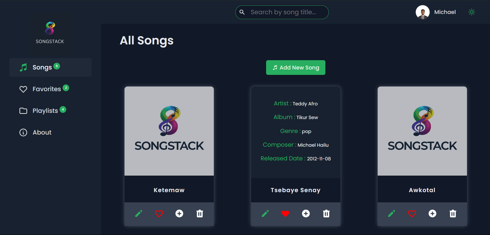
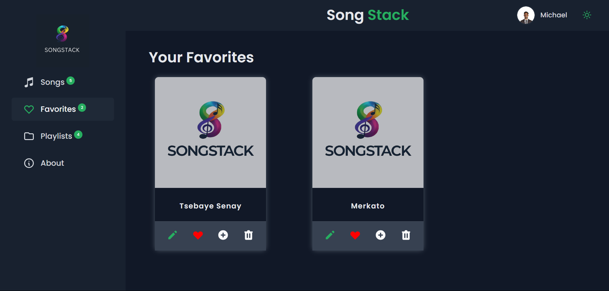
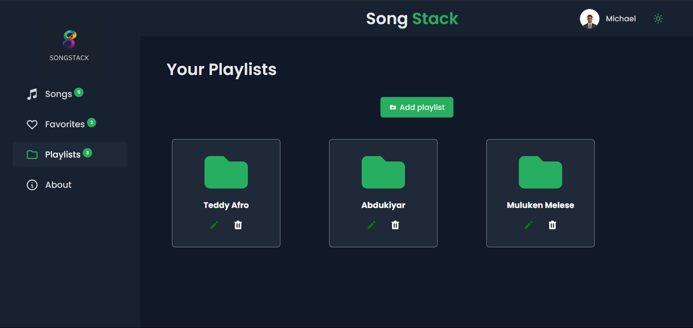

<h1>🎵 Song Stack</h1>
- Welcome to Song Stack, your one-stop destination for managing your music library with ease. With Song Stack, you can create, update, delete songs effortlessly, giving you full control over your musical collection.

<h1>🌐 Demo Link </h1>
- https://song-stack.netlify.app/

<h1>🚀 Get Started</h1>
- To run the application, use the following commands: 
  - `npm i` to install dependencies
  - `npm run dev` to start the application

<h1 align="center">🎶 Songs page</h1>

<h1 align="center">❤️ Favorites page</h1>

<h1 align="center">🎧 Playlists page</h1>

<h1>🔑 Key Features</h1>

<h2>Seamlessly Manage Your Music Collection</h2>

Song Management

- Effortlessly manage your music library with Song Stack. Perform actions such as adding, deleting, fetching, updating, and editing songs with ease. Keep your collection organized and up-to-date.

Favorites

- Discover your favorite tracks and mark them as favorites. Enjoy quick access to your most-loved songs for an immersive listening experience.

Playlists

- Create personalized playlists to curate your music journey. Organize your songs into playlists and manage them efficiently. Add songs to playlists, edit playlists, and customize your music experience like never before.

- Song Stack empowers you to take full control of your music library, making it a delightful and personalized experience for music enthusiasts. Elevate your music management with Song Stack today!

<h1>🛠 Technologies Used</h1>

- React: Frontend framework for building user interfaces.
- Redux: State management library for managing application state.
- Redux Saga: Middleware for handling asynchronous actions in Redux.
- Emotion: CSS-in-JS library for styling React components.
- Supabase: Database service used to store song and user data.

Contributing 🌟

If you'd like to contribute to Song Stack, please follow these guidelines:

- Fork the repository.
- Create a new branch (git checkout -b feature/new-feature).
- Make your changes.
- Commit your changes (git commit -am 'Add new feature').
- Push to the branch (git push origin feature/new-feature).
- Create a new Pull Request.
